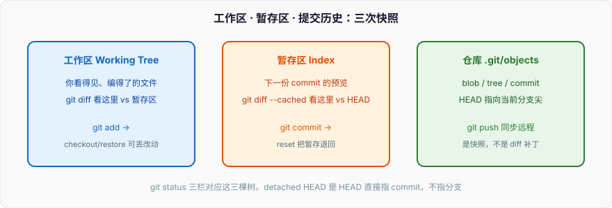
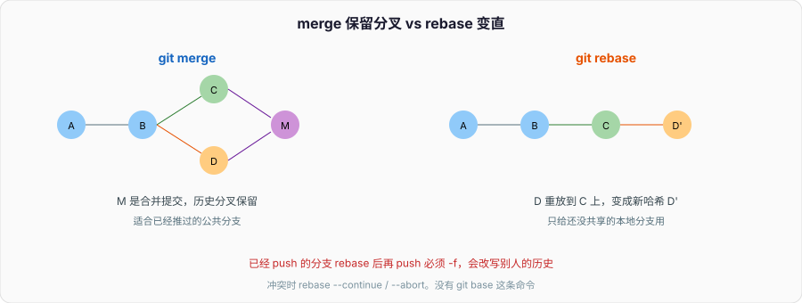
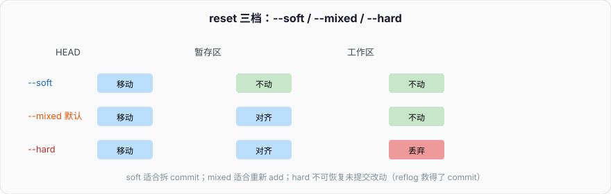

# Git基本命令

日常开发够用的一组命令。工作区 / 暂存区 / 仓库怎么对应，见 [Git实战](./Git实战.md)；每条命令的细节见 [Git基本命令详解](./Git基本命令详解.md)。



### 必知必会的Git命令

#### git checkout -b xxx

创建并切换到新分支 `xxx`，基线是当前 HEAD。等价于：

```bash
git branch xxx
git checkout xxx
```

Git 2.23 起更推荐 `git switch -c xxx`。`git checkout xxx`（没有 `-b`）是切换到已有分支，不会「把远程仓库复制到本地」。远程分支要先 `git fetch`，再 `git switch -c xxx origin/xxx`。

#### git diff

默认比较 **工作区 vs 暂存区**（还没 `add` 的改动）。不是「暂存区 vs 磁盘」这种说法。

```bash
git diff              # 工作区 vs 暂存区
git diff --cached     # 暂存区 vs HEAD（即将提交的内容）
git diff HEAD         # 工作区+暂存区 vs 最新提交
```

#### git add xxx

把工作区里 `xxx` 的改动写入暂存区（Index）。`git add -p` 可以按 hunk 挑选。

#### git commit

把暂存区做成一次新的 commit，挂到当前分支上。仓库对象在 `.git/objects`，不是什么「local 区」。

```bash
git commit -m "feat: 说明这次改了什么"
```

#### git push

把本地当前分支推到远程对应分支。默认推到 `origin` 上跟踪的那个。`-f` / `--force` 会覆盖远程历史，已经有人基于旧历史开发时不要用；非要改写用 `--force-with-lease`。

#### git branch -d xxx

删除已经合并过的本地分支。`-D` 是强制删除（没合并也删）。**没有**「不加 -D 表示创建」这种用法。创建分支是 `git branch xxx` 或 `git switch -c xxx`。

#### git pull

`git fetch` + `git merge`（或你配置成 rebase）。把远程跟踪分支的更新取回来，合并进当前分支。

#### git rebase xxx

把当前分支上「相对 xxx 多出来的 commit」一个个摘下来，接到 xxx 的最新尖上。历史变直，但 commit 哈希会变。

原先：`common → A`（xxx）和 `common → B`（当前）。rebase 后当前变成 `common → A → B'`（`B'` 是新哈希）。

没有 `git base` 这条命令。想把当前分支接到 main 上，写 `git rebase main`。



#### git checkout main / git checkout xxx

切换分支。现在更推荐 `git switch main`。`git checkout -- file` 是丢工作区改动，容易和切分支搞混，所以官方才拆出 `switch` 和 `restore`。

#### git pull origin main

从 `origin` 取 `main`，合并进当前分支。当前如果就在 `main` 上，等于更新本地 main。

#### git rebase main

我在功能分支上，把 main 的新提交移到我下面，再把我的 commit 一个个重放上去。冲突了就解决，然后 `git rebase --continue`；放弃用 `git rebase --abort`。

#### git push --force-with-lease origin xxx

rebase 之后远程还是旧哈希，普通 push 会被拒。`--force-with-lease` 只在远程没有别人新推的提交时才覆盖，比裸 `-f` 安全。公共分支（main / develop）不要 force push。



```bash
git reset --soft HEAD~1    # 撤 commit，改动还在暂存区
git reset HEAD~1           # 撤 commit，改动回工作区
git reset --hard HEAD~1    # 撤 commit，改动丢掉
```
